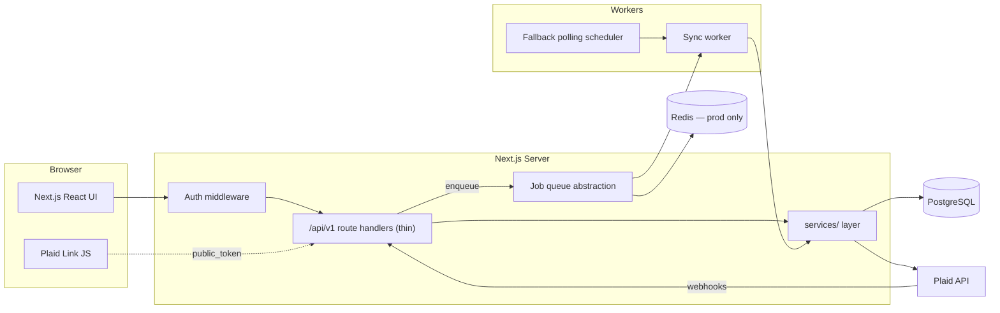
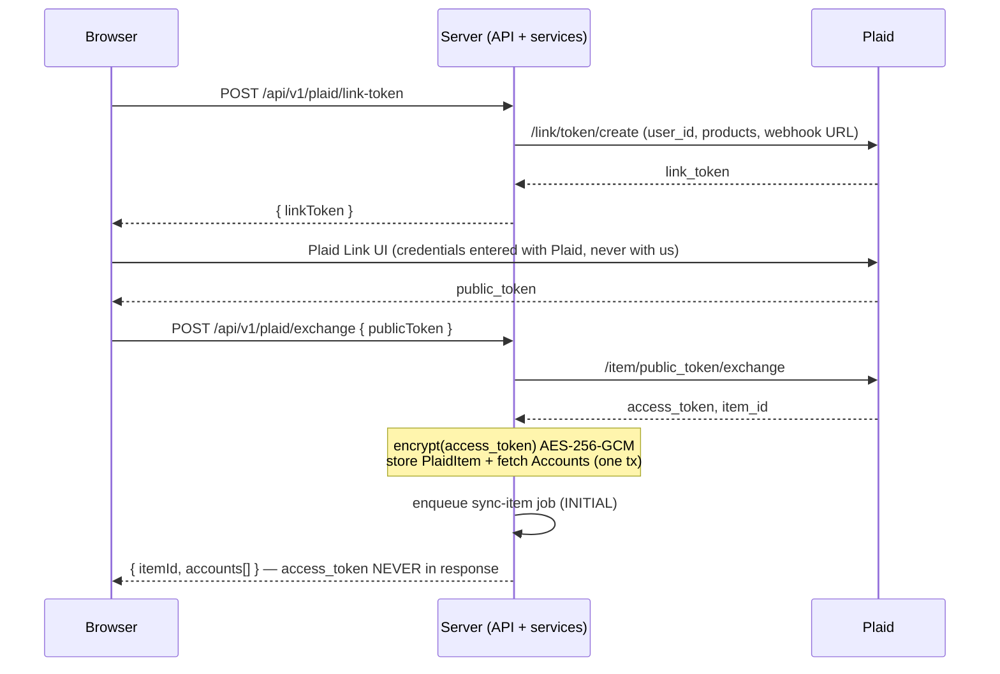
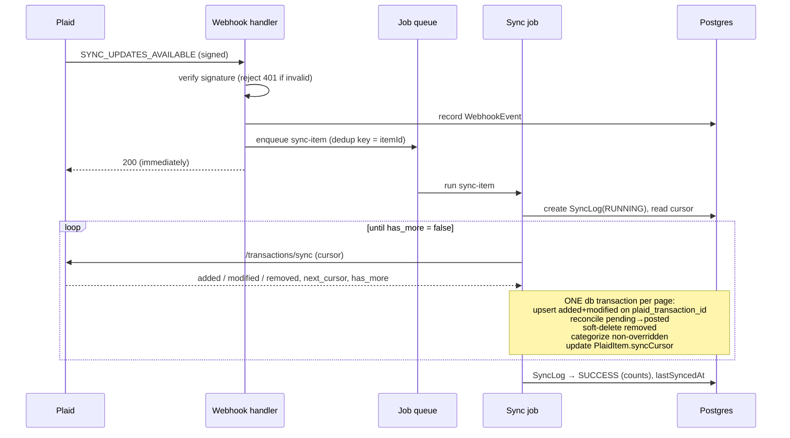

# Finance Dashboard — Architecture

Personal finance dashboard aggregating bank data via Plaid: connect accounts, sync
transactions automatically, categorize spending, visualize trends.

Companion document: [DECISIONS.md](./DECISIONS.md) — the running decision log. Every
non-obvious choice below has an entry there with the rejected alternative.

---

## 1. System Overview



Key structural rules:

1. **Route handlers are thin.** They authenticate, validate with Zod, call one service
   method, and serialize the result. No business logic in `app/api`.
2. **All Plaid access goes through the `PlaidService` interface.** Business logic never
   imports the Plaid SDK. Tests inject a fake.
3. **Webhooks never do work in the request path.** They verify, record, enqueue, and
   return 200 immediately.
4. **Every query is scoped by `userId`.** There is no repository method that accepts a
   record id without a user id.
5. **Money is integer minor units (cents) with an ISO currency code**, everywhere:
   database, services, API DTOs. Formatting to dollars happens only in the UI.

## 2. Folder Structure

```
finance-dashboard/
├── docs/                       # this document, DECISIONS.md, runbooks
├── prisma/
│   ├── schema.prisma
│   ├── migrations/             # every schema change; never hand-edit the DB
│   └── seed.ts                 # system categories + Plaid category mapping
├── docker-compose.yml          # postgres (+ redis from M3) for contributors using Docker
├── .github/workflows/ci.yml    # lint, typecheck, test
├── src/
│   ├── app/                    # Next.js App Router — routing + presentation only
│   │   ├── (auth)/             # sign-in pages (public)
│   │   ├── (dashboard)/        # authenticated app shell, pages
│   │   └── api/v1/             # REST route handlers (thin)
│   ├── components/             # React components (charts, tables, forms)
│   ├── server/                 # server-only code; "server-only" package guard
│   │   ├── auth/               # Auth.js config, requireUser()
│   │   ├── db/                 # Prisma client singleton
│   │   ├── lib/                # env.ts, logger.ts, errors.ts, crypto.ts, api-handler.ts
│   │   ├── services/
│   │   │   ├── plaid/          # PlaidService interface + SDK impl + fake
│   │   │   ├── sync/           # cursor sync, reconciliation
│   │   │   ├── categorization/ # override → rules → mapping → fallback
│   │   │   ├── aggregation/    # generic group-by queries
│   │   │   └── items/, accounts/, transactions/, categories/
│   │   └── jobs/
│   │       ├── queue.ts        # JobQueue interface + job payload types
│   │       ├── drivers/        # in-process (dev), BullMQ (prod)
│   │       └── handlers/       # sync-item.ts, poll-stale-items.ts
│   └── shared/                 # importable by client AND server
│       ├── schemas/            # Zod schemas for every API boundary
│       ├── types/              # DTO types inferred from Zod
│       └── constants.ts
└── tests/
    ├── unit/                   # categorization, reconciliation, crypto, rules
    ├── integration/            # route handlers against test DB, fake PlaidService
    └── e2e/                    # thin path against Plaid Sandbox
```

**Why `server/` + `shared/` instead of colocating in `app/`:** the App Router mixes
client and server modules freely; a hard directory boundary plus the `server-only`
package makes "this can never reach the browser" (Plaid tokens, crypto, DB) enforceable
by the compiler rather than by review. Rejected: colocation per route — it scatters
business logic and makes the service layer untestable in isolation.

## 3. Data Model

Full Prisma schema (authoritative once implemented; migrations are the source of truth):

```prisma
// ---------- Auth (Auth.js) ----------
model User {
  id            String    @id @default(cuid())
  email         String    @unique
  emailVerified DateTime?
  name          String?
  image         String?
  createdAt     DateTime  @default(now())
  updatedAt     DateTime  @updatedAt

  authAccounts  AuthAccount[]
  sessions      Session[]
  plaidItems    PlaidItem[]
  accounts      Account[]
  transactions  Transaction[]
  categories    Category[]
  categoryRules CategoryRule[]
}

// Auth.js "Account" renamed to avoid colliding with financial Account (D-004)
model AuthAccount {
  id                String  @id @default(cuid())
  userId            String
  type              String
  provider          String
  providerAccountId String
  refresh_token     String?
  access_token      String?
  expires_at        Int?
  token_type        String?
  scope             String?
  id_token          String?
  session_state     String?
  user              User    @relation(fields: [userId], references: [id], onDelete: Cascade)

  @@unique([provider, providerAccountId])
}

model Session {
  id           String   @id @default(cuid())
  sessionToken String   @unique
  userId       String
  expires      DateTime
  user         User     @relation(fields: [userId], references: [id], onDelete: Cascade)

  @@index([userId])
}

model VerificationToken {
  identifier String
  token      String   @unique
  expires    DateTime

  @@unique([identifier, token])
}

// ---------- Plaid connection ----------
enum PlaidItemStatus {
  ACTIVE          // syncing normally
  LOGIN_REQUIRED  // ITEM_LOGIN_REQUIRED — needs Link update mode
  ERROR           // retryable/unknown error state, still trying
  DISCONNECTED    // fatal (revoked, item removed) — read-only history
}

model PlaidItem {
  id                   String          @id @default(cuid())
  userId               String
  plaidItemId          String          @unique
  encryptedAccessToken String          // "v1:<iv>:<ciphertext>:<tag>" AES-256-GCM
  institutionId        String
  institutionName      String
  status               PlaidItemStatus @default(ACTIVE)
  errorCode            String?         // last Plaid error code, if any
  syncCursor           String?         // /transactions/sync cursor; null = initial sync
  lastSyncedAt         DateTime?
  createdAt            DateTime        @default(now())
  updatedAt            DateTime        @updatedAt

  user     User      @relation(fields: [userId], references: [id], onDelete: Cascade)
  accounts Account[]
  syncLogs SyncLog[]

  @@index([userId])
  @@index([status, lastSyncedAt]) // fallback poller: stale ACTIVE items
}

model Account {
  id                  String   @id @default(cuid())
  userId              String
  plaidItemId         String
  plaidAccountId      String   @unique
  name                String
  officialName        String?
  mask                String?  // last 4 digits — the only account number data we store
  type                String   // depository | credit | loan | investment
  subtype             String?
  currentBalanceCents BigInt?
  availableBalanceCents BigInt?
  isoCurrencyCode     String   @default("USD")
  hidden              Boolean  @default(false)
  createdAt           DateTime @default(now())
  updatedAt           DateTime @updatedAt

  user         User          @relation(fields: [userId], references: [id], onDelete: Cascade)
  plaidItem    PlaidItem     @relation(fields: [plaidItemId], references: [id], onDelete: Cascade)
  transactions Transaction[]

  @@index([userId])
  @@index([plaidItemId])
}

// ---------- Transactions ----------
model Transaction {
  id                   String    @id @default(cuid())
  userId               String
  accountId            String
  plaidTransactionId   String    @unique
  pendingTransactionId String?   // set by Plaid on the posted txn that replaces a pending one
  amountCents          BigInt    // Plaid sign convention: positive = outflow (D-006)
  isoCurrencyCode      String    @default("USD")
  date                 DateTime  @db.Date
  authorizedDate       DateTime? @db.Date
  name                 String    // raw description from the institution
  merchantName         String?
  pending              Boolean
  categoryId           String?
  userCategoryOverride Boolean   @default(false) // never recompute category when true
  plaidPfcPrimary      String?   // raw Plaid personal_finance_category, kept for re-mapping
  plaidPfcDetailed     String?
  deletedAt            DateTime? // soft delete (Plaid `removed` set)
  createdAt            DateTime  @default(now())
  updatedAt            DateTime  @updatedAt

  user     User      @relation(fields: [userId], references: [id], onDelete: Cascade)
  account  Account   @relation(fields: [accountId], references: [id], onDelete: Cascade)
  category Category? @relation(fields: [categoryId], references: [id], onDelete: SetNull)

  @@index([userId, date(sort: Desc)])       // recent transactions, date-range filters
  @@index([userId, categoryId, date])       // spend by category over range
  @@index([userId, merchantName])           // merchant filter/fuzzy prefilter
  @@index([userId, amountCents])            // amount-range filter, largest purchases
  @@index([accountId, date])
  @@index([pendingTransactionId])           // pending→posted reconciliation lookup
}

// ---------- Categorization ----------
enum CategoryFlow {
  EXPENSE
  INCOME
  TRANSFER
}

model Category {
  id        String       @id @default(cuid())
  userId    String?      // null = system category (D-008)
  parentId  String?
  name      String
  slug      String       // stable key; mapping table and seeds reference slugs
  flow      CategoryFlow @default(EXPENSE)
  isSystem  Boolean      @default(false)
  createdAt DateTime     @default(now())
  updatedAt DateTime     @updatedAt

  user         User?          @relation(fields: [userId], references: [id], onDelete: Cascade)
  parent       Category?      @relation("CategoryTree", fields: [parentId], references: [id])
  children     Category[]     @relation("CategoryTree")
  transactions Transaction[]
  rules        CategoryRule[]

  @@unique([userId, slug])
  @@index([userId])
}

enum RuleMatchField {
  MERCHANT_NAME
  DESCRIPTION
}

enum RuleMatchType {
  CONTAINS
  EQUALS
  STARTS_WITH
}

model CategoryRule {
  id             String         @id @default(cuid())
  userId         String
  categoryId     String
  priority       Int            // lower number = evaluated first
  matchField     RuleMatchField @default(MERCHANT_NAME)
  matchType      RuleMatchType  @default(CONTAINS)
  matchValue     String         // compared case-insensitively
  minAmountCents BigInt?        // optional amount-range condition
  maxAmountCents BigInt?
  accountId      String?        // optional account scoping
  isActive       Boolean        @default(true)
  createdAt      DateTime       @default(now())
  updatedAt      DateTime       @updatedAt

  user     User     @relation(fields: [userId], references: [id], onDelete: Cascade)
  category Category @relation(fields: [categoryId], references: [id], onDelete: Cascade)

  @@index([userId, priority])
}

// Data-driven Plaid → app category mapping (D-009). Seeded, editable without code changes.
model PlaidCategoryMapping {
  id            String @id @default(cuid())
  plaidDetailed String @unique // e.g. FOOD_AND_DRINK_COFFEE
  plaidPrimary  String         // e.g. FOOD_AND_DRINK
  categorySlug  String         // app category slug (system categories)
}

// ---------- Audit ----------
enum SyncTrigger {
  INITIAL
  WEBHOOK
  SCHEDULED
  MANUAL
}

enum SyncStatus {
  RUNNING
  SUCCESS
  FAILED
}

model SyncLog {
  id            String      @id @default(cuid())
  plaidItemId   String
  trigger       SyncTrigger
  status        SyncStatus  @default(RUNNING)
  addedCount    Int         @default(0)
  modifiedCount Int         @default(0)
  removedCount  Int         @default(0)
  cursorBefore  String?
  cursorAfter   String?
  errorCode     String?
  errorMessage  String?     // sanitized; never contains tokens or txn data
  startedAt     DateTime    @default(now())
  finishedAt    DateTime?

  plaidItem PlaidItem @relation(fields: [plaidItemId], references: [id], onDelete: Cascade)

  @@index([plaidItemId, startedAt(sort: Desc)])
}

// Webhook audit + idempotency support (D-013)
model WebhookEvent {
  id          String   @id @default(cuid())
  plaidItemId String?  // null if item unknown/unrecognized
  webhookType String
  webhookCode String
  payloadHash String   // sha256 of raw body — dedup within retry windows
  receivedAt  DateTime @default(now())
  processedAt DateTime?

  @@index([payloadHash])
  @@index([plaidItemId, receivedAt])
}
```

Schema decisions worth calling out (full rationale in DECISIONS.md):

- **`BigInt` for all money columns (D-005).** Postgres `integer` caps at ~$21.4M in
  cents — plausible to exceed for balances. `bigint` removes the class of bug. DTOs
  serialize to JS `number` (safe: values ≪ 2^53) via a single `moneyToNumber` helper.
- **Plaid sign convention preserved (D-006):** `amountCents` positive = outflow, matching
  Plaid exactly. Translating signs at the ingestion boundary is where reconciliation bugs
  breed; instead the aggregation/display layer owns presentation semantics.
- **Soft delete via `deletedAt` timestamp**, not a boolean — same filter cost, and the
  audit trail records *when* Plaid removed it.
- **Raw Plaid categories stored on each transaction** so the mapping table can be
  improved later and transactions re-mapped retroactively without re-fetching.
- **`flow` on Category** implements the Income/Transfer special-casing: aggregation
  excludes `TRANSFER` from spending totals and separates `INCOME` for
  income-vs-expense views. This is data, not hardcoded category names.

## 4. API Surface

All endpoints under `/api/v1`, JSON, Zod-validated, authenticated via Auth.js session
except where noted. Common error envelope in §7.

| Method | Path | Purpose |
|---|---|---|
| GET | `/api/v1/health` | Liveness + DB connectivity (public) |
| POST | `/api/v1/plaid/link-token` | Create Link token (also update-mode via `itemId`) |
| POST | `/api/v1/plaid/exchange` | public_token → encrypted access_token; creates Item + Accounts; enqueues initial sync |
| POST | `/api/v1/plaid/webhook` | Plaid webhooks (public; signature-verified; enqueue only) |
| GET | `/api/v1/items` | List connected institutions with status |
| POST | `/api/v1/items/:id/sync` | Manual sync trigger (enqueues) |
| DELETE | `/api/v1/items/:id` | Disconnect (Plaid `/item/remove` + mark DISCONNECTED) |
| GET | `/api/v1/accounts` | Accounts with balances |
| GET | `/api/v1/transactions` | List; filters: `dateFrom,dateTo,categoryId,accountId,merchant` (fuzzy), `minAmountCents,maxAmountCents,pending,search`; sort: `date\|amount\|merchant`; cursor pagination (D-011) |
| PATCH | `/api/v1/transactions/:id` | Set category (sets `userCategoryOverride=true`); clear override |
| GET/POST | `/api/v1/categories` | List tree / create custom |
| PATCH/DELETE | `/api/v1/categories/:id` | Rename/re-parent / delete (custom only; transactions fall back to Uncategorized) |
| GET/POST | `/api/v1/category-rules` | List / create rule |
| PATCH/DELETE | `/api/v1/category-rules/:id` | Edit / delete rule |
| POST | `/api/v1/category-rules/:id/apply` | Retroactively apply to existing non-overridden transactions |
| GET | `/api/v1/aggregates` | Generic aggregation — see below |

### The aggregation endpoint (D-012)

One parameterized endpoint powers every chart:

```
GET /api/v1/aggregates
  ?groupBy = category | category_top | month | week | merchant | account | flow
  &metric  = sum | count | avg
  &dateFrom & dateTo
  &flow = expense | income | transfer   (default: expense — transfers excluded)
  &categoryId & accountId & merchant     (same filter vocabulary as /transactions)
→ { data: [{ key, label, valueCents, count }], meta: { currency: "USD", ... } }
```

Every dashboard view maps onto it: spend this month (`groupBy=flow`, month range),
spend by category (`groupBy=category_top`), monthly trend (`groupBy=month`), income vs
expenses (`groupBy=flow` per month), largest purchases (that one is `/transactions?sort=amount`).
New charts require zero backend changes. Rejected: endpoint-per-chart — N× the handlers,
N× the auth/filter bugs. Guardrails: `groupBy`/`metric` are Zod enums (never raw SQL
identifiers from input), pending transactions included by default but filterable,
soft-deleted always excluded.

### Pagination (D-011)

Cursor-based everywhere: opaque cursor = base64 of `(date, id)` keyset. Offset
pagination was rejected: it skews under concurrent syncs (rows shift mid-pagination)
and degrades on large tables.

## 5. Auth Flow

Auth.js (NextAuth v5) with the Prisma adapter and **database sessions**.

- **Why database sessions over JWT (D-003):** instant revocation matters for financial
  data; session lookups are one indexed PK read; we already have Postgres. JWT's
  statelessness buys nothing at this scale and costs revocation.
- **Why Auth.js over Clerk (D-002):** keeps auth data in our Postgres (single backup
  and privacy story), free, no vendor coupling in every session check. Clerk buys
  polished UI at the cost of an external service holding identity for a finance app.
- Providers: email magic-link + Google OAuth, both toggled by env presence.
- Enforcement is layered: middleware redirects unauthenticated page loads;
  **every API handler and service method independently derives `userId` from the
  session** (`requireUser()`) — middleware is UX, not the security boundary.
- CSRF: Auth.js built-in double-submit token for auth routes; state-changing API routes
  are same-origin `fetch` with `SameSite=Lax` cookies + origin check in the shared
  handler wrapper.

## 6. Plaid Integration

### 6.1 Environments

`PLAID_ENV=sandbox|production` selects the SDK base path; with `PLAID_CLIENT_ID` /
`PLAID_SECRET` these are the **only** things that change between environments (verified
against current Plaid docs at implementation time — Plaid retired the "development"
environment in 2024; Sandbox is the free tier).

### 6.2 PlaidService interface (D-007)

```ts
interface PlaidService {
  createLinkToken(opts: { userId: string; accessToken?: string /* update mode */ }): Promise<LinkTokenResult>;
  exchangePublicToken(publicToken: string): Promise<{ accessToken: string; itemId: string }>;
  getAccounts(accessToken: string): Promise<PlaidAccountData[]>;
  syncTransactions(accessToken: string, cursor: string | null): Promise<SyncPage>;
  removeItem(accessToken: string): Promise<void>;
  getInstitution(institutionId: string): Promise<InstitutionData>;
  verifyWebhook(rawBody: string, headers: Headers): Promise<boolean>;
}
```

Business logic depends on this interface only. Two implementations: `PlaidSdkService`
(real, constructed from env) and `FakePlaidService` (in-memory, scriptable pages/errors,
used by unit + integration tests). Return types are **our** DTOs, not SDK types — the
SDK does not leak upward.

### 6.3 Link flow



The `access_token` exists in plaintext only inside the exchange service call and inside
`PlaidSdkService` calls after decryption. It is never logged, never serialized into a
DTO, never sent to the client. **This path is never delegated to a coding agent.**

Encryption: AES-256-GCM via Node `crypto`, 32-byte key from `ENCRYPTION_KEY` env (or
KMS later), random 12-byte IV per encryption, stored as `v1:<iv>:<ciphertext>:<tag>`
(base64). The `v1` prefix enables key/algorithm rotation: new writes use the newest
version, reads dispatch on prefix.

### 6.4 Sync flow



Invariants:

- **Cursor is written in the same DB transaction as the page's mutations.** A crash
  between pages resumes from the last committed cursor; Plaid re-sends that page;
  upserts make the replay idempotent.
- **Pending→posted reconciliation:** when an added/modified txn carries
  `pending_transaction_id`, find the pending row: copy its `categoryId` +
  `userCategoryOverride` if the user had overridden, then soft-delete the pending row
  and link the posted one. User edits survive posting. (Unit-test matrix: pending
  arrives → posts later; posts with amount change; pending removed without posting;
  posted arrives before we ever saw the pending.)
- **Cursor reset:** on Plaid's `TRANSACTIONS_SYNC_MUTATION_DURING_PAGINATION` error,
  restart the loop from the previous committed cursor. On a full item reset
  (`cursor` invalidated), re-sync from null cursor — upserts converge without
  duplicates because `plaid_transaction_id` is unique.
- **Dedup at the queue:** job dedup key = `sync-item:{itemId}` so a webhook burst runs
  one sync, not five. Combined with cursor semantics, running "too many" syncs is
  merely wasteful, never incorrect — idempotency is layered, not single-point.

### 6.5 Webhooks handled

| Webhook | Action |
|---|---|
| `SYNC_UPDATES_AVAILABLE` | Enqueue sync job (deduped) |
| `ITEM_LOGIN_REQUIRED`, `PENDING_EXPIRATION` | Item → `LOGIN_REQUIRED`; UI shows Reconnect (Link update mode) |
| `USER_PERMISSION_REVOKED`, `ITEM_REMOVED` | Item → `DISCONNECTED`; history retained read-only |
| `ITEM_ERROR` | Classify (§7); mark `ERROR` or `LOGIN_REQUIRED` |
| Unknown types | Log + record WebhookEvent + 200 (never 500 on unknown) |

Signature verification (Plaid JWT verification via `/webhook_verification_key/get`)
happens before anything else; unverified payloads are rejected and logged.

### 6.6 Fallback polling

A scheduled job (dev: in-process interval; prod: BullMQ repeatable job) every 6h
enqueues syncs for `ACTIVE` items with `lastSyncedAt` older than 12h — the
`(status, lastSyncedAt)` index serves exactly this query. The system stays correct with
webhooks disabled entirely; webhooks are a latency optimization, not a correctness
dependency.

### 6.7 Retries & error classification

Wrapper around every Plaid call classifies errors into:

| Class | Examples | Handling |
|---|---|---|
| `RETRYABLE` | `RATE_LIMIT_EXCEEDED`, `INTERNAL_SERVER_ERROR`, network timeouts | Exponential backoff + full jitter (base 1s, cap 60s, max 5 attempts), then job-level retry |
| `REAUTH` | `ITEM_LOGIN_REQUIRED`, `PENDING_EXPIRATION` | No retry; Item → `LOGIN_REQUIRED`; surface Reconnect |
| `FATAL` | `ITEM_NOT_FOUND`, `ACCESS_NOT_GRANTED`, invalid credentials config | No retry; Item → `DISCONNECTED` (or alert if config-level); SyncLog FAILED |

## 7. Categorization

Resolution order, highest wins — implemented as an ordered chain in
`CategorizationService.resolve(txn)`:

1. **Manual override** (`userCategoryOverride=true`): short-circuit; re-sync never
   touches it (the sync upsert explicitly excludes `categoryId` when the flag is set).
2. **User rules**: active `CategoryRule`s by ascending `priority`; first match wins.
   Matching is case-insensitive on merchant/description with optional amount-range and
   account conditions. No regex in v1 (ReDoS surface + UX complexity; `CONTAINS/EQUALS/
   STARTS_WITH` covers the real cases — revisit on demand).
3. **Plaid mapping**: `PlaidCategoryMapping` row for the txn's
   `personal_finance_category.detailed`, falling back to a primary-level default row.
   A table, not a switch — new mappings are seed-data changes.
4. **Fallback**: system `uncategorized`.

Custom categories are rows (`userId` set), addable at runtime. Rule changes and
mapping changes can be applied retroactively to non-overridden transactions via the
`apply` endpoint — recategorization is a pure function of stored data, since raw Plaid
categories are persisted per transaction.

## 8. Error Handling

Typed hierarchy in `server/lib/errors.ts`:

```
AppError (abstract: code, httpStatus, publicMessage, cause?)
├── ValidationError(400)   ├── AuthenticationError(401)
├── ForbiddenError(403)    ├── NotFoundError(404)
├── ConflictError(409)     ├── RateLimitError(429)
├── UpstreamError(502)     — Plaid/external failures, wraps classification
└── InternalError(500)
```

Every route handler is wrapped by one `apiHandler()` higher-order function that owns:
session extraction, Zod parsing (→ `ValidationError` with field details), the
try/catch, logging, and serialization to the single envelope:

```json
{ "error": { "code": "ITEM_LOGIN_REQUIRED", "message": "This connection needs to be re-linked.", "requestId": "req_…", "details": [] } }
```

`publicMessage` is written for humans and never contains internals; the `cause` chain
(stack, Plaid error body) goes to logs only, keyed by `requestId` so a user report can
be joined to the full log line. Unknown thrown values become `InternalError` with a
generic message — nothing else can escape to the client.

## 9. Logging & Observability

- **pino**, JSON to stdout (12-factor; the platform ships logs).
- `requestId` generated per request in `apiHandler`, propagated via `AsyncLocalStorage`
  so service-layer logs carry it without parameter threading; job runs get a `jobId`
  equivalent.
- **Redaction is default-deny for sensitive shapes:** pino redact paths for
  `access_token`, `public_token`, `authorization`, `cookie`, plus a hard rule —
  **no transaction bodies, merchant names, amounts, or account numbers in logs.** Sync
  logging is counts + ids only (and `SyncLog` in the DB is the queryable audit trail).
- Every sync run produces one structured completion line: itemId, trigger, counts,
  duration, cursor advanced (boolean).

## 10. Security Model

| Layer | Control |
|---|---|
| Secrets | Env vars only; `.env.example` documents every var; `.env*` gitignored; startup fails fast on missing/invalid env (Zod-validated `env.ts`) |
| Plaid tokens | AES-256-GCM at rest (§6.3); never in DTOs, logs, or the client bundle (`server-only` guard on `server/`) |
| AuthZ | `requireUser()` in every handler; every Prisma query filters by `userId`; cross-user access is structurally absent, not checked ad hoc. Integration tests assert 404 (not 403 — no existence oracle) for other users' resource ids |
| Sessions | DB sessions, `HttpOnly` + `Secure` + `SameSite=Lax` cookies, instant revocation |
| CSRF | Auth.js token on auth routes; origin check + SameSite for API mutations |
| Headers | CSP (no third-party scripts except Plaid Link), `X-Frame-Options: DENY`, `nosniff`, HSTS in prod — set in `next.config.ts` |
| Webhooks | Signature verification before parsing; the only unauthenticated mutating route, and it only enqueues |
| Logs | §9 redaction; no financial data |
| Input | Zod at every boundary; enums for anything reaching a query plan |

## 11. Background Jobs

```ts
interface JobQueue {
  enqueue<T extends JobName>(name: T, payload: JobPayload<T>, opts?: { dedupKey?: string; delaySeconds?: number }): Promise<void>;
  schedule(name: JobName, cron: string): Promise<void>;   // repeatable jobs
}
```

- **Dev driver:** in-process — `enqueue` runs the handler on `setImmediate` with an
  in-memory dedup set; `schedule` uses `setInterval`. Zero infra to run the repo.
- **Prod driver:** BullMQ + Redis — dedup via jobId, retries/backoff, repeatable jobs.
- Selected by `QUEUE_DRIVER=inprocess|bullmq`. Handlers are identical across drivers;
  they must be idempotent (guaranteed by cursor/upsert semantics, §6.4).
- Rejected: platform-specific cron (Vercel cron) as the primary abstraction — usable as
  a trigger for the poller, but the queue interface keeps us portable.

## 12. Testing Strategy

| Layer | Scope | Infra |
|---|---|---|
| Unit (Vitest) | Categorization chain, rule matching, pending→posted matrix, removed txns, cursor-reset replay, crypto round-trip, error classification | none — `FakePlaidService`, in-memory |
| Integration | Route handlers via `next-test-api-route-handler`-style invocation against a real test Postgres; authz cross-user assertions; sync end-to-end with fake Plaid pages | Postgres (CI service container) |
| E2E (thin) | Sandbox: link via `sandbox/public_token/create`, initial sync, webhook simulation | Plaid Sandbox creds, run on demand not per-PR |

The two highest-risk areas — reconciliation and categorization — get exhaustive unit
matrices before their milestones are considered done (M3/M4 acceptance criteria).

## 13. Scalability Notes

Honest scale target: one household, then tens–hundreds of users. Design choices that
keep the door open without paying distributed-systems tax now:

- All hot queries are index-backed keyset scans; the `Transaction` indexes in §3 map
  1:1 to the filter API. At millions of rows per user, add monthly aggregate rollups
  (a materialized summary table maintained by the sync job) — the aggregates endpoint
  contract wouldn't change.
- Sync work is already out-of-process-shaped; moving workers to a separate deployment
  is a config change (BullMQ workers can run anywhere with Redis + DB access).
- Multi-currency: currency code already stored per amount; aggregation currently
  assumes USD and would gain a conversion step — no schema change.
- Postgres is the only stateful component until Redis arrives in M3, and Redis holds
  only queue state (loss = delayed syncs, not data loss).

## 14. Milestones

Implementation proceeds strictly M0→M8 per the project brief; each milestone lands as
tested, committed, conventional-commit work before the next begins. The decision log
(DECISIONS.md) is updated whenever a milestone forces or reverses a choice.
